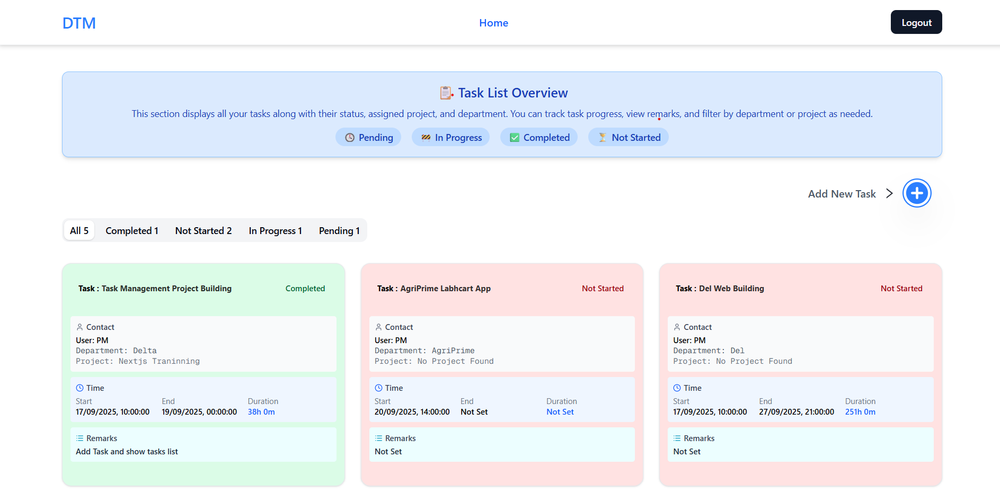
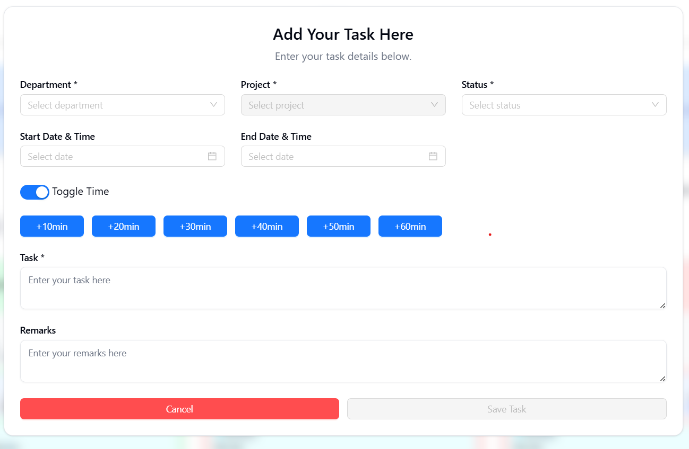
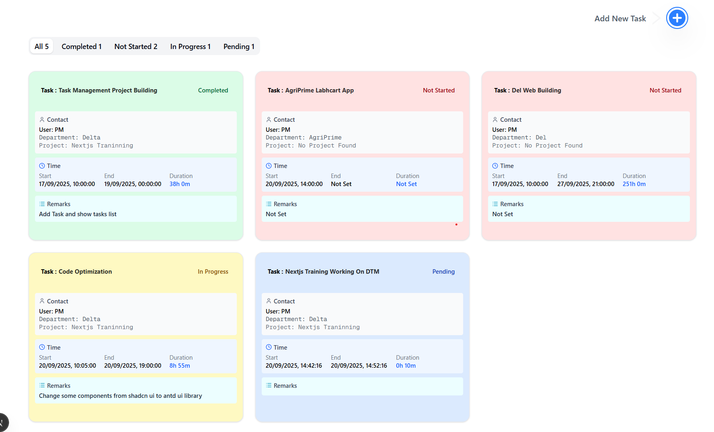

# Task Management Delta

A task management application built using **Next.js**. Helps you organize, track, and manage tasks through a clean, modern interface.

---

## Table of Contents

- [Demo](#demo)  
- [Features](#features)  
- [Tech Stack](#tech-stack)  
- [Getting Started](#getting-started)  
  - [Prerequisites](#prerequisites)  
  - [Installation](#installation)  
  - [Running Locally](#running-locally)  
- [Project Structure](#project-structure)  
- [Configuration](#configuration)  
- [Contributing](#contributing)  
- [License](#license)

---

## Demo





---

## Features

- Create, edit, delete tasks  
- Task categorization (e.g. by status, priority)  
- Responsive UI  
- State management via store  
- [Any additional features you’ve built in your project]  

---

## Tech Stack

| Component | Technology |
|-----------|------------|
| Frontend framework | Next.js |
| State management | *(you can mention what you are using — Redux / Context / Zustand / etc.)* |
| Styling / CSS | *(Tailwind / CSS Modules / Styled Components / etc.)* |
| Other libraries | *(list e.g. for forms, validation, routing, APIs if applicable)* |

---

## Getting Started

### Prerequisites

Make sure you have:

- Node.js (version xx or higher)  
- npm / yarn / pnpm installed  

---

### Installation

```bash
git clone https://github.com/dasharath-delta/task-management-delta.git
cd task-management-delta
npm install
# or
yarn
# or
pnpm install
Running Locally
bash
Copy code
npm run dev
# or
yarn dev
# or
pnpm dev
Then open http://localhost:3000 in your browser to view the app.

Project Structure
ruby
Copy code
task-management-delta/
├── app/               # Next.js app directory
├── components/        # UI components
├── data/              # Any seed / mock data
├── lib/               # Utility functions / helpers
├── public/            # Public assets
├── store/             # State management
├── .gitignore
├── next.config.mjs
├── package.json
└── README.md
(Modify this to match your actual folder/file layout.)

Configuration
If your app uses environment variables or other config files, mention them here. Example:

ini
Copy code
NEXT_PUBLIC_API_URL=your_api_endpoint

License

Specify your license here (e.g. MIT, Apache 2.0, etc.)